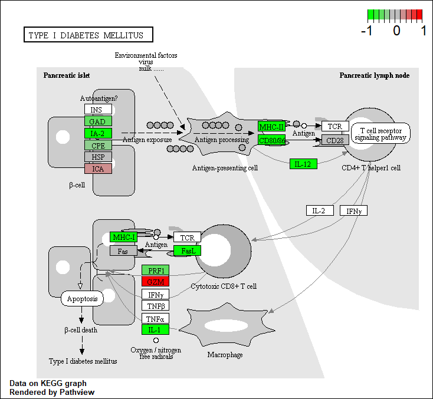

This week we are looking at differential expression analysis.

The data for this hands-on session comes from a published RNA-seq experiment where airway smooth muscle cells were treated with dexamethasone, a synthetic glucocorticoid steroid with anti-inflammatory effects (Himes et al. 2014).

# 2. Import countData and colData

## Import/read the data from Himes et al.

```{r}
counts <- read.csv("airway_scaledcounts.csv", row.names=1)
metadata <-  read.csv("airway_metadata.csv")
```

Let's have a look at this data

```{r}
head(counts)
head(metadata)
```

Sanity check on correspondence of counts and metadata

```{r}
all(metadata$id == colnames(counts))
```

> Q1. How many genes are in this dataset?

There are `r nrow(counts)` genes in this dataset. 

> Q2. How many 'control' cell lines do we have?

```{r}
n.control <- sum(metadata$dex == "control")
```

There are `r n.control` control cell lines in this dataset.

# 3. Toy Differential Gene Expression

## Extract and Summarize Control Samples

To find out where the control samples are, we need metadata. 

> Q3. How would you make the above code in either approach more robust?

We would do rowMeans() instead of rowSums()/4

```{r}
control <- metadata[metadata$dex == "control", ]
control$id
control.counts <- counts[, control$id]
control.mean <- rowMeans(control.counts)
head(control.mean)
```

## Extract and Summarize Treated Samples

> Q4. Follow the same procedure for the treated samples (i.e. calculate the mean per gene across drug treated samples and assign to a labeled vector called treated.mean)

```{r}
treated <- metadata[metadata$dex == "treated", ]
treated$id
treated.counts <- counts[, treated$id]
treated.mean <- rowMeans(treated.counts)
head(treated.mean)
```

Store these results together in a new datafram called `meancounts`

```{r}
meancounts <- data.frame(control.mean, treated.mean)
```

Let's make a plot to explore the results a little. 

> Q5 (a). Create a scatter plot showing the mean of the treated samples against the mean of the control samples.

```{r}
plot(meancounts[,1], meancounts[,2], xlab="Control", ylab="Treated")
```

> Q5 (b). You could also use the ggplot2 package to make this figure producing the plot below. What geom_?() function would you use for this plot?

```{r}
library(ggplot2)

ggplot(meancounts) +
  aes(control.mean, treated.mean) +
  geom_point()
```

We will make a log-log plot to draw out this skewed data and see what is going on. 
> Q6. Try plotting both axes on a log scale. What is the argument to plot() that allows you to do this?

```{r}
plot(meancounts[,1], meancounts[,2], xlab="Control", ylab="Treated", log = "xy")
```

We often use log2 transformations when dealing with this sort of data. This log2 transformation has this nice property where if there is no change, the log2 value will be zero, and if it is double, the log2 value will be 1, and if halved, it will be -1. 

```{r}
meancounts$log2fc <- log2(meancounts[,"treated.mean"] / meancounts[,"control.mean"])
head(meancounts)
```

We need to get rid of zero counts that we cannot say anything about. 

```{r}
zero.vals <- which(meancounts[,1:2] == 0, arr.ind=TRUE)

to.rm <- unique(zero.vals[,1])
mycounts <- meancounts[-to.rm,]
head(mycounts)
```

> Q7. What is the purpose of the arr.ind argument in the which() function call above? Why would we then take the first column of the output and need to call the unique() function?

It tells us which rows and columns the "TRUE" values are in, aka which genes (rows) and samples (columns) have zero counts. Calling unique() will ensure we don't any row twice if it has zero entries in both samples. 

How many genes are remaining?

```{r}
nrow(mycounts)
```
## Use fold change to see up and down regulated genes

> Q8. Using the up.ind vector above can you determine how many up regulated genes we have at the greater than 2 fc level?

```{r}
up.ind <- mycounts$log2fc > 2
sum(up.ind)
```

> Q9. Using the down.ind vector above can you determine how many down regulated genes we have at the greater than 2 fc level? 

```{r}
down.ind <- mycounts$log2fc < (-2)
sum(down.ind)
```

> Q10. Do you trust these results? Why or why not?

Not fully because we don't know anything about the stats (ie significance). 

# 4. DESeq2 Analysis

Let’s do this the right way. DESeq2 is an R package specifically for analyzing count-based NGS data like RNA-seq. It is available from Bioconductor. Bioconductor is a project to provide tools for analyzing high-throughput genomic data including RNA-seq, ChIP-seq and arrays. 

```{r}
# load up DESeq2
library(DESeq2)
citation("DESeq2")
```

```{r}
dds <- DESeqDataSetFromMatrix(countData=counts, colData=metadata, design=~dex)
dds
```

## DESeq Analysis

```{r}
#results(dds)
```

```{r}
dds <- DESeq(dds)
```

```{r}
res <- results(dds)
res
```

We can get some basic summary tallies using the `summary()` function

```{r}
summary(res, alpha = 0.05)
```

## Volcano Plot

Make a summary plot of our results. 

```{r}
plot(res$log2FoldChange, -log(res$padj))
```

# Adding Annotation Data

```{r}
library("AnnotationDbi")
library("org.Hs.eg.db")
```
```{r}
columns(org.Hs.eg.db)
```

```{r}
res$symbol <- mapIds(org.Hs.eg.db, keys=row.names(res), keytype="ENSEMBL", column="SYMBOL", multiVals="first")
```

```{r}
head(res)
```

> Q11. Run the mapIds() function two more times to add the Entrez ID and UniProt accession and GENENAME as new columns called res$entrez, res$uniprot and res$genename.

```{r}
res$entrez <- mapIds(org.Hs.eg.db,
                     keys=row.names(res),
                     column="ENTREZID",
                     keytype="ENSEMBL",
                     multiVals="first")

res$uniprot <- mapIds(org.Hs.eg.db,
                     keys=row.names(res),
                     column="UNIPROT",
                     keytype="ENSEMBL",
                     multiVals="first")

res$genename <- mapIds(org.Hs.eg.db,
                     keys=row.names(res),
                     column="GENENAME",
                     keytype="ENSEMBL",
                     multiVals="first")

head(res)
```

```{r}
ord <- order( res$padj )
#View(res[ord,])
head(res[ord,])
```

```{r}
write.csv(res[ord,], "deseq_results.csv")
```

# 6. Data Visualization

## Volcano Plots

```{r}
plot( res$log2FoldChange,  -log(res$padj), 
      xlab="Log2(FoldChange)",
      ylab="-Log(P-value)")
```

```{r}
plot( res$log2FoldChange,  -log(res$padj), 
 ylab="-Log(P-value)", xlab="Log2(FoldChange)")

# Add some cut-off lines
abline(v=c(-2,2), col="darkgray", lty=2)
abline(h=-log(0.05), col="darkgray", lty=2)
```

```{r}
# Setup our custom point color vector 
mycols <- rep("gray", nrow(res))
mycols[ abs(res$log2FoldChange) > 2 ]  <- "red" 

inds <- (res$padj < 0.01) & (abs(res$log2FoldChange) > 2 )
mycols[ inds ] <- "blue"

# Volcano plot with custom colors 
plot( res$log2FoldChange,  -log(res$padj), 
 col=mycols, ylab="-Log(P-value)", xlab="Log2(FoldChange)" )

# Cut-off lines
abline(v=c(-2,2), col="gray", lty=2)
abline(h=-log(0.1), col="gray", lty=2)
```


# 7. Pathway Analysis

## Pathway Analysis with R and Bioconductor

```{r}
library(pathview)
library(gage)
library(gageData)

data(kegg.sets.hs)

# Examine the first 2 pathways in this kegg set for humans
head(kegg.sets.hs, 2)
```

```{r}
foldchanges = res$log2FoldChange
names(foldchanges) = res$entrez
head(foldchanges)
```

```{r}
# Get the results
keggres = gage(foldchanges, gsets=kegg.sets.hs)
```

```{r}
attributes(keggres)
```

```{r}
# Look at the first three down (less) pathways
head(keggres$less, 3)
```

```{r}
pathview(gene.data=foldchanges, pathway.id="hsa05310")
```

```{r}
# A different PDF based output of the same data
pathview(gene.data=foldchanges, pathway.id="hsa05310", kegg.native=FALSE)
```


> Q12. Can you do the same procedure as above to plot the pathview figures for the top 2 down-reguled pathways?

```{r}
pathview(gene.data=foldchanges, pathway.id="hsa05332")

pathview(gene.data=foldchanges, pathway.id="hsa04940")
```




## OPTIONAL: Plotting counts for genes of interest

```{r}
i <- grep("CRISPLD2", res$symbol)
res[i,]
```

```{r}
rownames(res[i,])
```

```{r}
plotCounts(dds, gene="ENSG00000103196", intgroup="dex")
```

```{r}
# Return the data
d <- plotCounts(dds, gene="ENSG00000103196", intgroup="dex", returnData=TRUE)
head(d)
```

```{r}
boxplot(count ~ dex , data=d)
```

```{r}
library(ggplot2)
ggplot(d, aes(dex, count, fill=dex)) + 
  geom_boxplot() + 
  scale_y_log10() + 
  ggtitle("CRISPLD2")
```

```{r}
sessionInfo()
```


